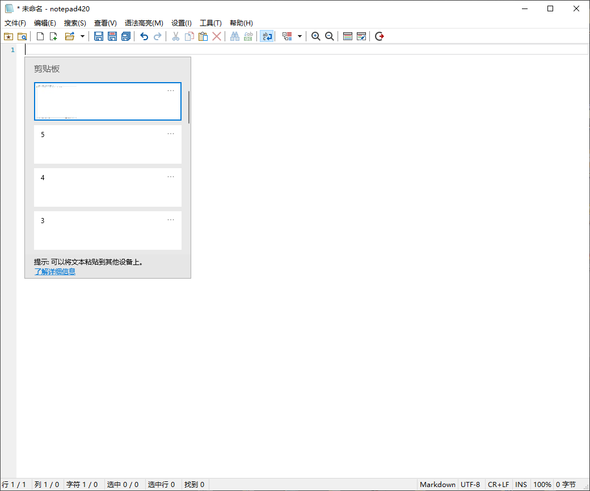

# notepad420

**中文说明** · [English ↓](#english)

> Windows 系统记事本替身 —— [Notepad4](https://github.com/zufuliu/notepad4)（zufuliu）的个人 fork，按需 cherry-pick，不跟上游主线。
>
> **使命：让 Harness（Codex / Claude Code / pi etc.）里 Ctrl+G 打开的文本编辑器无痛承载截图给 AI。**截图丢进去，跳出来的是 `C:\...\Temp\notepad420-Paste\xxxx.png` 的文件路径——不再贴 data URI，不再要复制路径。

## 图片粘贴
此 fork 的打造目的，也是它与其他notepad fork 的主要差异。

- 复制任意图片，在 np420 中，直接 **Ctrl+V**
- np420 自动把图片保存到 `%TEMP%\notepad420-Paste\<时间戳>.png`，并把那个**文件路径**粘到你光标处——文档里从此是路径，不是冗长的 data URI 影响编辑
- 粘贴缓存超过 64 张 / 128 MiB 触顶时拒绝并状态栏提示，不弹模态框、不弹文件对话框
- 反向粘贴 `Ctrl+Shift+V`：把里层图片 data URI 原样粘贴，不落成文件

| Ctrl+G 唤出（未贴入） | 贴入后得到缓存路径 |
| --- | --- |
|  |  |

这意味着：截图分享、问题反馈、临时证据都不再需要手动另存、找路径、再回到终端。

[](License.txt) [](https://github.com/Sakyvo/notepad420/releases) [](https://github.com/Sakyvo/notepad420/releases)

## 特性速览

- **图片/文件粘贴改造（P1–P4）**：拖入文件或 Ctrl+V 粘贴文件 → 直接得到路径文本；截图粘贴自动落盘到 `%TEMP%\notepad420-Paste` 并以文件名引用；`Ctrl+Shift+V` 反向粘贴原文；Markdown 中的 data URI 图片解码进缓存目；缓存触顶拒绝 + 状态栏提示，不弹模态窗
- **Markdown 为中心**：默认方案即 Markdown（GitHub GFM），空白文档开箱即高亮；NP3 风格标题/粗体/斜体外观；默认简体中文界面
- **记事本替换器**（`notepad420-replacer.exe`）：一键替换系统记事本、关联文本文件打开方式、接管终端 Ctrl+G 外部编辑器（`EDITOR` / `VISUAL`）
- **默认 UI 调参**：四重绘制动效、F60FastScroll（高刷新率滚动）、自动滚动等一套默认开关重调
- **locale 交付只带 en + zh-Hans**（上游其余语言卫星dll 不出现在安装包与 zip）
- **双形式分发**：Inno Setup 安装器（`notepad420-setup-x64-<ver>.exe`）+ 便携 zip（`notepad420_i18n_x64_v<ver>.zip`）

## 下载与安装

从 [Releases](https://github.com/Sakyvo/notepad420/releases) 取最新版：

| 文件 | 用途 |
|---|---|
| `notepad420-setup-x64-<ver>.exe` | 安装器（管理员提供，完成页可选替换系统记事本 / 关联文本文件 / 接管 Ctrl+G） |
| `notepad420_i18n_x64_v<ver>.zip` | 便携包（解压即用，含替换器与中文卫星） |

要求 Windows 10 x64 及以上。

## 从源码构建

详见 [构建与输出契约](.docs/spec/build-output.md)（所有生成物只落 `.target/`）。快路：

```
build\VisualStudio\build_x64.bat            # 主程序 + matepath，x64 Release
locale\build.bat Build x64 Release          # 语言卫星 dll
build\VisualStudio\build_replacer.bat       # 记事本替换器
build\VisualStudio\make_installer.bat       # Inno Setup 安装器 → .target\installer\
build\make_zip.bat MSVC x64 Release Locale  # 便携 zip → .target\
```

## 与上游的关系

本项目是 fork，非上游 Notepad4 官方版本；作者、协议、版权说明保留在 [License.txt](License.txt) 与关于对话框中（Zufu Liu and all contributors）。

Credit: [linux.do](https://linux.do) Community

---

<a id="english"></a>
# notepad420 (English)

**English** · [中文说明 ↑](#notepad420)

> A drop-in notepad replacement for Windows 10 LTSC — a personal fork of [Notepad4](https://github.com/zufuliu/notepad4), not following upstream mainline.

[](License.txt) [](https://github.com/Sakyvo/notepad420/releases)

## How Image Paste Works

This is the whole point of this fork — the scenario it was built for.

- Screenshot anywhere (in your Harness or any Windows app), open notepad420 via Ctrl+G (or just launch it), hit **Ctrl+V**
- notepad420 saves the image to `%TEMP%\notepad420-Paste\<timestamp>.png` and pastes the **file path** at your cursor — your document gets a path, not a blob
- Send that path back to the Harness (or anywhere): it's a plain PNG you can upload, diff, or copy
- When the paste cache fills up (64 images / 128 MiB), pasting is refused with a status-bar hint — no modal dialog, no file-picker
- Inverse paste with `Ctrl+Shift+V`: paste the original image data-URI as-is, no file written

| Opened by Ctrl+G (before paste) | After pasting you get a cache path |
| --- | --- |
|  |  |

No more manual "Save As", no more hunting for paths, no more leaving the terminal to share a screenshot.

## Highlights

- **Paste overhaul (P1–P4)**: paste files/drag-ins get their path text; screenshots stay into `%TEMP%\notepad420-Paste` by filename; `Ctrl+Shift+V` inverted-paste original text; data-URI images in Markdown decode into the cache dir; cache-full refusal + status-bar hint, no modal block
- **Markdown-centric**: default scheme is Markdown (GitHub GFM) on a blank document; NP3-style heading/bold/italic look; simplified-Chinese UI by default
- **Notepad replacer** (`notepad420-replacer.exe`): one-shot replace of system Notepad, text-file association, and terminal Ctrl+G external editor (`EDITOR` / `VISUAL`)
- **Retuned defaults**: quadruple-buffered drawing, F60FastScroll, auto-scroll, UI defaults re-tuned
- **Shipped locale set: en + zh-Hans only** (upstream satellite languages are not packaged)
- **Two delivery forms**: Inno Setup installer + portable zip

## Download & Install

Grab the latest build from [Releases](https://github.com/Sakyvo/notepad420/releases):

| File | Purpose |
|---|---|
| `notepad420-setup-x64-<ver>.exe` | Installer (elevated, optional system-Notepad replacement / file association / Ctrl+G takeover at finish) |
| `notepad420_i18n_x64_v<ver>.zip` | Portable package (unzip and run, replacer included) |

Requires Windows 10 x64 or newer.

## Build from Source

See [build-output contract](.docs/spec/build-output.md) (all generated artifacts are confined to `.target/`). Quick path:

```
build\VisualStudio\build_x64.bat
locale\build.bat Build x64 Release
build\VisualStudio\build_replacer.bat
build\VisualStudio\make_installer.bat
build\make_zip.bat MSVC x64 Release Locale
```

## Relationship to Upstream

This repository is a personal fork, not the official Notepad4. Upstream copyright and authorship remain honored in [License.txt](License.txt) and the About dialog (Zufu Liu and all contributors).

Credit: linux.do Community
